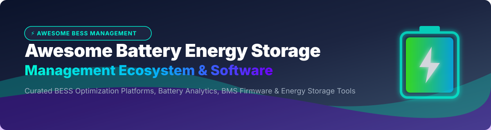

# 🔋 Awesome Battery Energy Storage Management (BESS) ⚡

  

  
  
  
  
  
  

---

## 🌟 Top Battery Energy Storage Management Ecosystem & Software Tools

> **Curated List of SaaS Platforms, Open-Source GitHub Projects, BMS Firmware & Battery Analytics Frameworks**  
> *Focused on Battery Analytics, BESS Optimization, Degradation Modeling, State of Health (SoH) & Smart Energy Storage Operations.*  
> **Last updated: September 2026** 📅

Welcome to the ultimate developer and engineer resource for **Battery Energy Storage Management Systems (BESS)**, **Battery Management System (BMS) Firmware**, and **Clean Energy Storage Optimization Software**. This curated list tracks top-tier **SaaS platforms** and **open-source GitHub repositories** designed to monitor, simulate, analyze, and optimize battery health, degradation, charging speed, and market bidding.

---

## 📑 Table of Contents
- [🏢 SaaS & Commercial Platforms](#-saas--commercial-platforms)
- [💻 Open-Source GitHub Projects](#-open-source-github-projects)
- [🤝 How to Contribute](#-how-to-contribute)
- [💖 Support & Sponsorship](#-support--sponsorship)
- [⚖️ Disclaimer](#%EF%B8%8F-disclaimer)
- [📈 Star History](#-star-history)

---

## 🏢 SaaS & Commercial Platforms

> 📊 **Market Size & Industry Structure**: The global Battery Energy Storage System (BESS) software and analytics market size is estimated at **$1.5 Billion - $2.5 Billion (2025/2026)** and is projected to expand at over 22% CAGR driven by renewable grid integration and EV fleet expansion. The sector is currently **moderately fragmented**, combining established energy conglomerates with specialized AI predictive analytics scale-ups.

| SaaS Platform | Description | Est. Company Size (Revenue / Valuation) | Starting Tier Pricing | Free Tier / Trial Limit |
| :--- | :--- | :--- | :--- | :--- |
| **[Fluence Mosaic](https://www.fluencecorp.com/)** | AI-powered bidding and optimization software for energy storage assets in wholesale markets. | **$2.3B Revenue** / **$1.2B Market Cap** | $1,500/month per MW managed (Enterprise quotes) | 30-day sandbox trial (Simulated market bidding) |
| **[Ampcontrol](https://www.ampcontrol.io/)** | AI-powered EV fleet charging and energy management software. | **~$150M Revenue** / **~$135M Valuation** | $15/month per connected charger/vehicle | 14-day free trial (up to 5 chargers) |
| **[Stem](https://www.stem.com/)** | AI-driven energy storage software (Athena platform) for grid-scale and behind-the-meter applications. | **$156M Revenue** / **$40M Market Cap** | $500/month base platform fee | 30-day interactive demo environment |
| **[TWAICE](https://www.twaice.com/)** | Predictive analytics platform for battery energy storage operations, extending lifespan and safety. | **~$20M Revenue** / **~$150M Valuation** (€24M EIB loan) | $1,200/month per asset package | 14-day trial for asset demo telemetry |
| **[ACCURE Battery Intelligence](https://www.accure.net/)** | AI & physics-based battery models for cell diagnostics, warranty tracking, and PCS analytics (24+ GWh monitored). | **~$15M ARR** / **~$80M Valuation** ($34.8M raised) | $800/month per MWh battery capacity | 30-day free trial (1 BESS battery container) |
| **[Breathe Battery Technologies](https://www.breathebatherapy.com/)** | Adaptive charging and battery management software for speed and lifetime extension. | **~$11M Revenue** / **~$60M Valuation** ($33M raised) | $450/month per development license | 14-day evaluation license |
| **[Voltaiq](https://www.voltaiq.com/)** | Enterprise battery intelligence platform for battery manufacturers and fleet operators. | **~$3.2M ARR** / **~$25M Valuation** | $990/month per user/data stream | 14-day trial with sample dataset uploads |
| **[Enode](https://www.enode.com/)** | API platform connecting energy devices (batteries, EVs, chargers) to management apps. | **~$3M ARR** / **~$20M Valuation** ($15M raised) | $0.15/month per active device | **Free Forever**: First 5 connected energy devices free |
| **[About:Energy](https://www.aboutenergy.io/)** | Battery data & modeling platform (Voltt) providing cell characterization and battery models. | **~$2M Revenue** / **~$15M Valuation** ($2.3M raised) | $350/month per model access | 7-day trial with 1 sample battery cell dataset |
| **[BatterMachine](https://www.batterymachine.com/)** | Battery analytics and intelligence platform for EV fleets and ESS. | **~$1.5M Revenue** / **~$10M Valuation** | $199/month starting tier | 14-day free trial (up to 2 vehicle batteries) |
| **[Brill Power](https://www.brillpower.com/)** | Intelligent BMS software and cell-level power electronics analytics. | **~$1.5M Revenue** / **~$10M Valuation** | $250/month per controller node | 30-day evaluation kit trial |
| **[Piclo Flex](https://picloflex.com/)** | Marketplace platform for flexibility services and battery storage asset registration. | **~$1M Revenue** / **~$8M Valuation** | $150/month market access fee | 30-day free trial for asset onboarding |
| **[Nuvation Energy](https://www.nuvationenergy.com/)** | Battery management software interfaces & energy storage controllers. | **~$1M Revenue** / **~$5M Valuation** | $300/month per site gateway | 14-day trial access to nControl UI |
| **[BMS PowerSafe](https://www.bmspowersafe.com/)** | Cloud battery management software for industrial and storage packs. | **~$1M Revenue** / **~$5M Valuation** | $100/month starting module | 14-day free trial |
| **[Yotta Energy](https://www.yottaenergy.com/)** | Micro-grid & distributed energy storage monitoring platform. | **~$1M Revenue** / **~$5M Valuation** | $75/month per micro-inverter/BESS unit | 30-day free trial |
| **[PowerUp](https://www.powerup.com/)** | Battery analytics and degradation tracking solutions. | **~$800K Revenue** / **~$4M Valuation** | $120/month per pack monitoring | 14-day trial with demo telemetry |
| **[Battery Cloud](https://www.batterycloud.com/)** | Cloud-based battery monitoring and analytics web service. | **~$500K Revenue** / **~$3M Valuation** | $49/month basic tier | 14-day free trial (1 battery monitor) |
| **[Banyan Infrastructure](https://www.banyaninfrastructure.com/)** | Project finance and asset management software for energy storage. | **~$500K Revenue** / **~$3M Valuation** | $500/month enterprise base | 14-day project simulation trial |

---

## 💻 Open-Source GitHub Projects

Sorted by GitHub_Stars 🌟 (Descending).

- **[PyBaMM](https://github.com/pybamm-team/PyBaMM)**   
  *Python Battery Mathematical Modelling (PyBaMM) solves physics-based electrochemical battery models. Widely used for simulating BESS cell performance, degradation, thermal management, and SOC/SOH estimation.*

- **[EMHASS](https://github.com/davidusb-geek/emhass)**   
  *Energy Management for Home Assistant with advanced battery and power management. Features intermediate battery SoC targets, battery-first priority, PV curtailment scheduling, and battery health preservation.*

- **[foxBMS 2](https://github.com/foxBMS/foxbms-2)**   
  *The premier modular open-source BMS development platform certified by OSHWA. Universal hardware & software platform for controlling modern electrical energy storage systems of any size (Lithium-Ion, Solid State, Sodium-Ion, Redox-Flow).*

- **[LibreSolar BMS](https://github.com/LibreSolar)**   
  *Open-source hardware and Zephyr RTOS firmware for battery management systems and solar MPPT charge controllers. Supports 5-15 Li-ion cells with TI bq769x0 frontends.*

- **[bjpirt/pyBMS](https://github.com/bjpirt/pyBMS)**   
  *MicroPython-based BMS implementation for DIY home energy storage systems and EV battery pack monitoring.*

- **[ShepherdBMS](https://github.com/Northeastern-Electric-Racing/Shepherd-BMS)**   
  *From-scratch Battery Management System application developed by Northeastern Electric Racing. Features custom BMS firmware integrated with Analog Devices ADBMS AFEs.*

- **[battery-degradation-prognosis](https://github.com/pnnl/battery-degradation-prognosis)**   
  *Tool for long-term prognosis of redox flow battery parameter degradation using Transformer-based deep learning time-series models. Developed by Pacific Northwest National Laboratory (PNNL).*

- **[BatPar](https://github.com/BatParDevleperTeam/BatPar)**   
  *Open-source battery parameterization toolkit with comprehensive user and developer manuals facilitating BMS modeling and parameter estimation.*

- **[PolynomialSoH](https://github.com/iitis/PolynomialSoH)**   
  *Interpretable machine learning framework for battery State of Health (SoH) estimation using sensor data and resistance readings.*

- **[QuESt PCM](https://www.sandia.gov/ess/tools-resources/quest/quest-grid-planning-toolbox/pcm)**   
  *Open-source power system production cost modeling tool from Sandia National Laboratories. Provides high-fidelity representation of energy storage systems with cost-optimal dispatch.*

- **[GridFlexPy](https://ieeexplore.ieee.org/abstract/document/11297666)**   
  *Open-source Python framework for power flow analysis and BESS operation in microgrids integrated with OpenDSS.*

- **[PyPESOL](https://dl.acm.org/doi/full/10.1145/3679240.3734691)**   
  *Python P2P Energy Sharing Optimization Library for cost optimization in peer-to-peer energy sharing scenarios with battery/PV capacity modeling.*

---

## 🤝 How to Contribute

1. 🍴 Fork the repository.
2. 📝 Add/edit entries in `README.md` (following the established markdown table and badge format).
3. 📌 Include project name, official URL/repository link, description, and Stars_Count/pricing details.
4. 🚀 Submit a Pull Request (PR) with a clear summary of your changes.

---

## 💖 Support & Sponsorship

If you find this curated list of Battery Energy Storage Management tools helpful, please consider supporting the project!

- ⭐ **Star** this repository on GitHub to help others discover it.
- 🔀 **Fork** and share it with battery engineers, researchers, and BESS operators.
- ☕ **Buy Me a Coffee**: Support ongoing open-source curation and maintenance on GitHub Sponsors:  
  

---

## ⚖️ Disclaimer

- This is a **community-curated** list — non-exhaustive and not an official financial or safety endorsement.
- Battery management systems must comply with local safety standards and regulations (e.g. UL 1973, NFPA 855).
- Self-hosted open-source BMS implementations require proper electrical engineering, cell balancing, and thermal isolation to prevent thermal runaway.

---

## 📈 Star History

